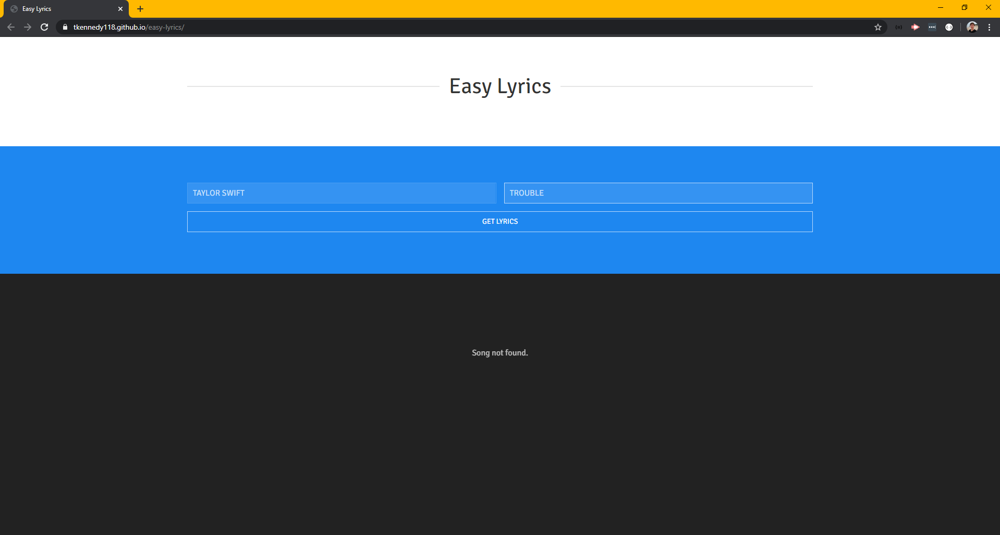
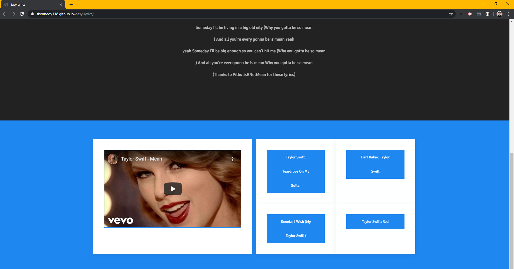
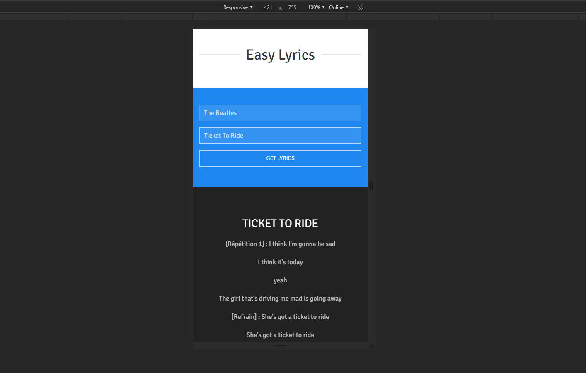
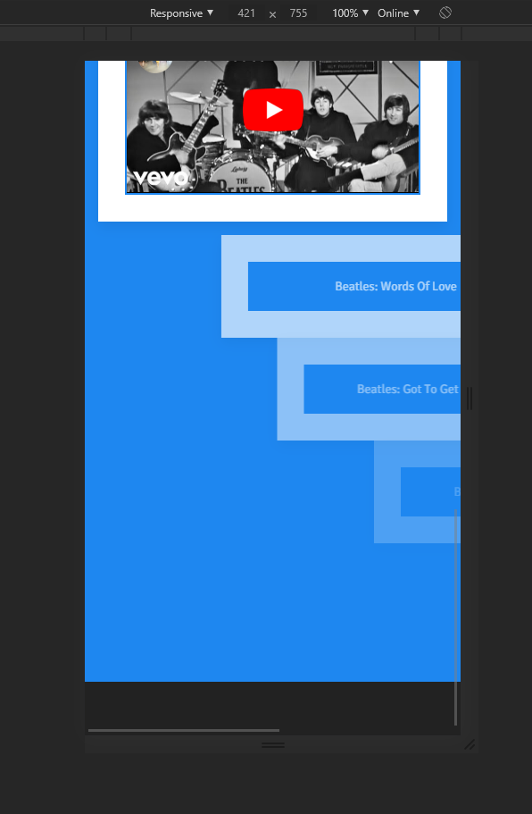

# easy-lyrics

[Link to deployed application](https://tkennedy118.github.io/easy-lyrics/)

# Description
This applicaiton allows users to enter an artist name and song title, then it retrieves the corresponding song lyrics, music video, and related titles. The application utilizes AJAX requests to retrieve information about user inputs. The following APIs are used:

* [searchLy API v1](https://searchly.asuarez.dev/docs/v1)
* [lyrics.ovh](https://lyricsovh.docs.apiary.io/#)
* [YouTube Data API](https://developers.google.com/youtube/v3)

Once a user inputs a song title, the page either responds with a "cannot find song" message, or it fills in the related information. As users scroll down, they will notice a mobile-first design. The related titles at the bottom of each page are clickable, and will auto-input the song to get the requested data from the APIs. 

# Languages and Libraries
* CSS
* HTML5
* JavaScript
* jQuery
* AJAX
* UIKit

# API Credentials
The only API that requires authentication is the YouTube Data API. We used API keys (no OAuth 2.0) for this application. The directions for obtaining an API Key are explained [here](https://developers.google.com/youtube/registering_an_application) on YouTube's Data API page. It should be noted that a free API key only has a limited amount of uses per day. Once you have obtained the YouTube API key, add it to your config.js file (example file provided in example.config.js, but should be renamed 'config.js').

# Screenshots of Deployed Application

